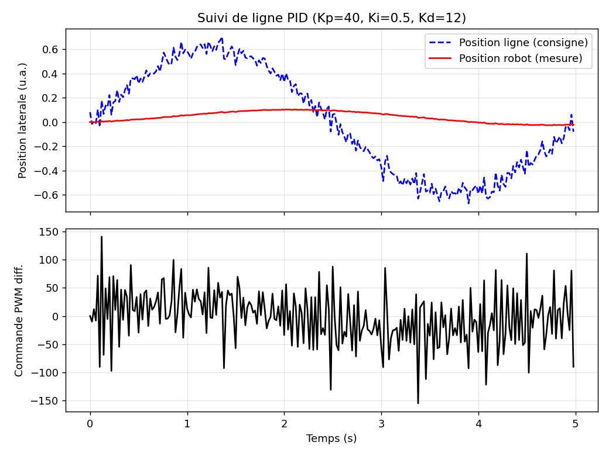
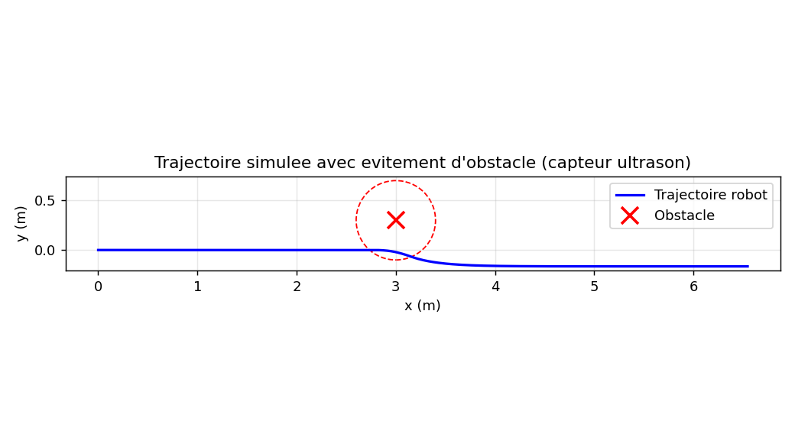
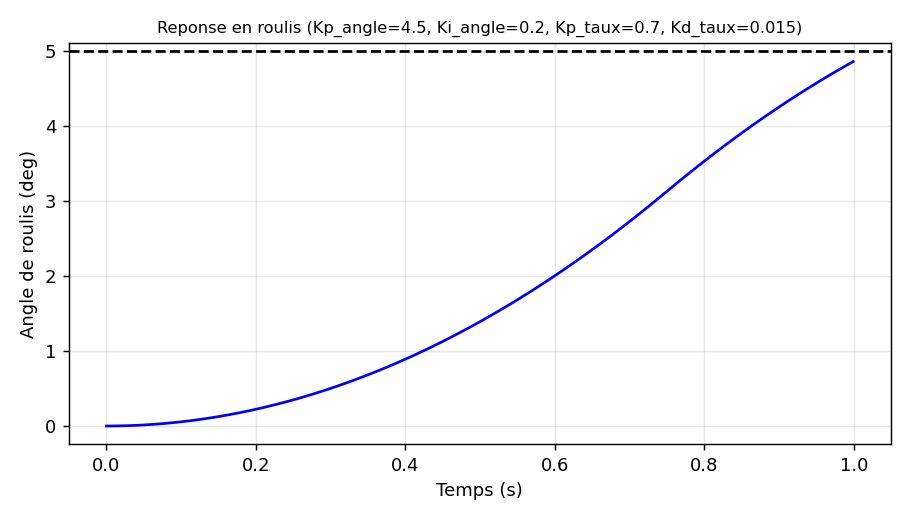
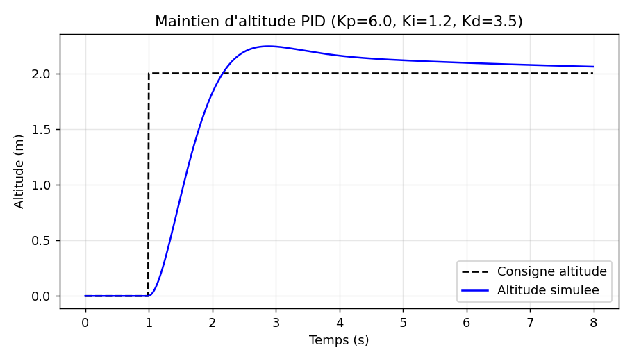
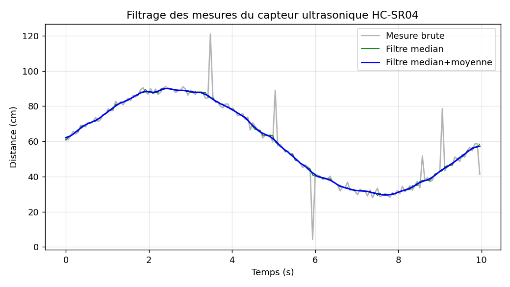

# 🚗🛸 Voiture & Drone Autonomes — Développement Embarqué C++ (Arduino)

Projet complet de développement embarqué en **C++/Arduino** pour une **voiture
autonome** (suivi de ligne + évitement d'obstacle) et un **drone autonome**
(stabilisation d'attitude par IMU), accompagné d'une démarche d'ingénieur
complète : dimensionnement justifié, **simulations MATLAB**, réglage de
correcteurs PID, mesures et graphes de performance.

> ⚠️ **Sécurité :** ce projet pilote des actionneurs (moteurs, hélices).
> Toujours tester **hélices retirées** / **roues surélevées** avant tout essai
> réel. Voir `tests/PLAN_DE_TESTS.md`.

---

## 📋 Sommaire

- [Aperçu du projet](#-aperçu-du-projet)
- [Structure du dépôt](#-structure-du-dépôt)
- [Matériel utilisé (BOM)](#-matériel-utilisé-bom)
- [Démarche d'ingénierie](#-démarche-dingénierie)
- [Résultats de simulation](#-résultats-de-simulation)
- [Mise en route](#-mise-en-route)
- [Architecture logicielle](#-architecture-logicielle)
- [Sécurité](#-sécurité)
- [Limites et améliorations possibles](#-limites-et-améliorations-possibles)
- [Licence](#-licence)

---

## 🎯 Aperçu du projet

| | Voiture autonome | Drone autonome |
|---|---|---|
| **Fonction** | Suivi de ligne + évitement d'obstacle | Stabilisation d'attitude (vol stationnaire) |
| **Capteurs** | HC-SR04 (ultrason), 3× IR réflectifs, encodeurs à fourche | MPU6050 (IMU 6 axes), récepteur radio RC |
| **Actionneurs** | 2× moteurs CC (pont en H L298N), servomoteur de scan | 4× ESC brushless (config. quadricoptère `+`) |
| **Boucles de commande** | PID suivi de ligne (20 ms), PI vitesse, machine à états évitement | PID cascade angle→taux (250 Hz), filtre complémentaire IMU |
| **Carte cible** | Arduino Uno / Nano | Arduino Uno / Nano |

Le projet suit une démarche d'ingénierie classique :
**dimensionnement → simulation → implémentation → tests → validation**,
détaillée dans `docs/`.

---

## 🗂 Structure du dépôt

```
.
├── README.md                          <- ce fichier
├── LICENSE
├── docs/
│   ├── 01_rapport_dimensionnement.md  <- calculs justificatifs (couple, poussée, autonomie...)
│   ├── 02_schema_cablage.md            <- schémas de câblage (voiture + drone)
│   ├── 03_resultats_simulation.md      <- tableaux de résultats + interprétation
│   └── figures/                        <- graphes générés par les scripts MATLAB
├── matlab/
│   ├── calculs_dimensionnement.m       <- reproduit les calculs du rapport
│   ├── voiture_pid_tuning.m            <- réglage PID moteur + suivi de ligne
│   ├── voiture_simulation_trajectoire.m<- simulation cinématique + évitement obstacle
│   ├── drone_pid_stabilisation.m       <- PID cascade roulis, rejet perturbation
│   ├── drone_simulation_vol.m          <- maintien altitude + mission waypoints 3D
│   └── analyse_capteurs.m              <- filtrage et métriques capteur ultrason
├── voiture/
│   ├── platformio.ini                  <- configuration PlatformIO (carte Uno)
│   ├── src/
│   │   ├── voiture_autonome.ino        <- sketch principal
│   │   └── config.h                     <- broches, gains PID, constantes
│   └── lib/
│       ├── Capteurs/                    <- HC-SR04 + capteurs IR (lecture + filtrage)
│       ├── Actionneurs/                 <- pilotage moteurs CC / châssis différentiel
│       └── PID/                          <- correcteur PID générique
├── drone/
│   ├── platformio.ini                  <- configuration PlatformIO (carte Uno)
│   ├── src/
│   │   ├── drone_autonome.ino           <- sketch principal
│   │   └── config.h                      <- broches, gains PID, sécurités
│   └── lib/
│       ├── IMU/                          <- MPU6050 + filtre complémentaire
│       ├── Moteurs/                      <- pilotage 4× ESC + mixage quadricoptère
│       └── PID/                          <- correcteur PID générique
└── tests/
    ├── PLAN_DE_TESTS.md                 <- procédure de validation en 4 niveaux
    └── log_capteurs_exemple.csv         <- exemple de log capteur (pour analyse_capteurs.m)
```

---

## 🔧 Matériel utilisé (BOM)

### Voiture
| Composant | Référence indicative | Quantité |
|---|---|---|
| Microcontrôleur | Arduino Uno / Nano | 1 |
| Pont en H | L298N | 1 |
| Motoréducteurs CC | Type TT, 6V | 4 |
| Capteur ultrason | HC-SR04 | 1 |
| Capteurs IR réflectifs | TCRT5000 ou similaire | 3 |
| Servomoteur (scan) | SG90 | 1 |
| Encodeurs à fourche optiques | générique | 2 |
| Batterie | 2× Li-ion 18650 (7,4V, 2000mAh) | 1 pack |

### Drone (quadricoptère 250 mm)
| Composant | Référence indicative | Quantité |
|---|---|---|
| Microcontrôleur | Arduino Uno / Nano | 1 |
| IMU | MPU6050 | 1 |
| Moteurs brushless | 2204, 2300KV | 4 |
| Hélices | 5040 | 4 |
| ESC | 20-30A, BLHeli | 4 |
| Récepteur radio RC | 4 voies minimum | 1 |
| Batterie | LiPo 3S, 11,1V, 1500mAh, 25C | 1 |
| Cadre | 250 mm (config. `+`) | 1 |

---

## 🧮 Démarche d'ingénierie

Tous les choix (couple moteur, poussée, autonomie, gains PID) sont
**calculés et justifiés**, pas choisis au hasard :

1. **Dimensionnement** (`docs/01_rapport_dimensionnement.md`) : bilan des
   forces, couple moteur requis, poussée nécessaire (rapport poussée/poids),
   autonomie énergétique.
2. **Modélisation** : fonction de transfert du moteur CC (1ᵉʳ ordre),
   modèle dynamique simplifié du roulis (`Ixx·θ̈ = τ`).
3. **Simulation et réglage PID** (`matlab/`) : réponse indicielle, calcul du
   dépassement, temps de stabilisation, rejet de perturbation — **avant**
   toute implémentation sur cible.
4. **Implémentation embarquée** (`voiture/`, `drone/`) : mêmes gains que ceux
   validés en simulation, code modulaire (capteurs / actionneurs / PID
   séparés) pour être testable indépendamment.
5. **Tests** (`tests/PLAN_DE_TESTS.md`) : validation progressive, de la
   simulation au vol/roulage réel.

---

## 📊 Résultats de simulation

Le détail complet (tableaux de mesures, interprétation) est dans
[`docs/03_resultats_simulation.md`](docs/03_resultats_simulation.md).
Aperçu :

**Voiture — suivi de ligne (PID) et évitement d'obstacle**




**Drone — stabilisation en roulis et maintien d'altitude**




**Filtrage du capteur ultrason (réduction du bruit ≈ 73 %)**



| Indicateur | Résultat |
|---|---|
| Dépassement régulation vitesse moteur (PI) | ≈ 0,5 % |
| RMSE suivi de ligne | ≈ 0,41 (u.a.) |
| Distance min. à l'obstacle (marge de sécurité) | 0,32 m (> 0,08 m seuil arrêt urgence) |
| Réduction du bruit capteur ultrason (filtrage) | ≈ 73 % |
| Dépassement stabilisation roulis (drone) | < 1 % |
| Erreur max. pendant rafale de vent simulée | ≈ 5,5 ° |
| Dépassement maintien d'altitude | ≈ 12 % |

> Les figures ci-dessus sont fournies en aperçu (générées automatiquement).
> Les scripts `.m` correspondants dans `matlab/` sont le livrable de
> référence : ouvrez-les et exécutez-les directement dans MATLAB
> (Control System Toolbox requise pour les fonctions `tf`, `pid`, `feedback`,
> `step`, `stepinfo`) pour les reproduire et les affiner.

---

## 🚀 Mise en route

### 1. Simulations MATLAB

```matlab
cd matlab
calculs_dimensionnement       % calculs de dimensionnement + tableau de synthèse
voiture_pid_tuning             % réglage PID moteur + suivi de ligne
voiture_simulation_trajectoire % trajectoire avec évitement d'obstacle
drone_pid_stabilisation        % stabilisation roulis + rejet de perturbation
drone_simulation_vol           % maintien altitude + mission waypoints
analyse_capteurs               % filtrage capteur ultrason
```

Chaque script sauvegarde ses figures dans `docs/figures/` et affiche les
métriques calculées dans la console.

### 2. Firmware Arduino — Voiture

**Avec PlatformIO (recommandé)** — la structure `src/` + `lib/` du dossier
`voiture/` est directement compatible :
```bash
cd voiture
pio run          # compilation
pio run -t upload  # téléversement sur la carte
pio device monitor  # moniteur série
```

**Avec l'IDE Arduino classique** — celui-ci ne compile que les fichiers
situés dans le dossier du sketch : copier le contenu de `voiture/lib/*/`
(fichiers `.h`/`.cpp`) et `voiture/src/config.h` dans le même dossier que
`voiture_autonome.ino`, puis retirer les préfixes de chemin relatif
(`../lib/...`) des lignes `#include` pour ne garder que le nom de fichier.

1. Câbler selon `docs/02_schema_cablage.md`.
2. Téléverser sur Arduino Uno/Nano.
3. Poser la voiture sur fond clair hors de la ligne pour la calibration
   automatique au démarrage (LED intégrée clignote pendant 1s).
4. Ouvrir le moniteur série (9600 bauds) pour la télémétrie.

### 3. Firmware Arduino — Drone

**Avec PlatformIO (recommandé)** :
```bash
cd drone
pio run
pio run -t upload
pio device monitor
```

**Avec l'IDE Arduino classique** — même remarque que pour la voiture :
copier le contenu de `drone/lib/*/` et `drone/src/config.h` dans le dossier
du sketch `drone_autonome.ino`, et simplifier les chemins d'`#include`.

1. Câbler selon `docs/02_schema_cablage.md`.
2. **Hélices retirées**, alimenter le drone : le MPU6050 est calibré au
   démarrage (ne pas bouger le drone pendant ce temps).
3. Vérifier au moniteur série (115200 bauds) que les angles évoluent
   correctement quand on incline le drone à la main.
4. Une fois validé hélices retirées, remonter les hélices et procéder à un
   essai en extérieur avec un pilote aux commandes radio.

> Compatible **Arduino IDE** (structure classique `.ino` + onglets) et
> **PlatformIO** (structure `src/` + `lib/` déjà organisée en conséquence).

---

## 🏗 Architecture logicielle

Les deux firmwares partagent la même philosophie modulaire :

```
config.h            → toutes les constantes (broches, gains PID, seuils)
lib/PID/             → correcteur PID générique, réutilisable, anti-windup
lib/<Capteurs...>/   → acquisition + filtrage, indépendant de la logique de commande
lib/<Actionneurs...>/→ pilotage bas niveau des moteurs/ESC
src/*.ino            → orchestration : machine à états + boucles temporisées
```

**Voiture — machine à états :**
`SUIVI_LIGNE → OBSTACLE_DETECTE → EVITEMENT → SUIVI_LIGNE`, avec
`ARRET_URGENCE` prioritaire sur tous les états.

**Drone — boucle cascade (250 Hz) :**
`consigne pilote → PID angle → consigne de taux → PID taux → mixage moteurs`

---

## ⚠️ Sécurité

- **Ne jamais** faire tourner les moteurs de la voiture roues au sol lors
  des premiers tests logiciels (la surélever sur des cales).
- **Ne jamais** monter les hélices du drone avant d'avoir validé la
  cohérence des corrections PID (moteurs qui accélèrent du bon côté).
- Le firmware du drone coupe les moteurs (`FAILSAFE`) si l'angle dépasse
  `ANGLE_LIMITE_SECURITE_DEG` (45° par défaut) ou en cas de perte de
  liaison radio (`TIMEOUT_RADIO_MS`).
- Toujours garder un doigt sur l'interrupteur d'armement / la manette
  radio lors des premiers essais en vol.

---

## 🔭 Limites et améliorations possibles

- **Voiture :** la régulation de vitesse par encodeurs (`pidVitesse`) est
  présente dans le code mais affichée en télémétrie seulement (non
  appliquée à la commande finale) pour garder l'exemple lisible — à
  activer pour compenser la chute de tension batterie en conditions
  réelles.
- **Drone :** pas de magnétomètre (pas de maintien de cap absolu), pas de
  GPS/baromètre embarqués dans ce firmware minimal — la mission de
  waypoints 3D (`drone_simulation_vol.m`) est une démonstration en
  simulation, à étendre avec un GPS + baromètre et un microcontrôleur plus
  puissant (STM32/Teensy) pour un vol de mission réellement autonome.
- **Fusion de capteurs :** filtre complémentaire simple ; un filtre de
  Kalman étendu améliorerait la précision au prix d'une charge de calcul
  plus importante (à évaluer selon la puissance du microcontrôleur cible).
- **Communication :** aucune télémétrie sans fil (Bluetooth/LoRa) n'est
  implémentée ; le monitoring se fait via le port série filaire.

---

## 📄 Licence

Ce projet est publié sous licence **MIT** — voir [`LICENSE`](LICENSE).

---

## 🙌 Contribuer

Les contributions sont bienvenues : ouvrez une *issue* ou une *pull
request*. Merci de faire précéder toute modification des gains PID d'une
mise à jour du script MATLAB correspondant et des résultats dans
`docs/03_resultats_simulation.md`, conformément à la démarche
dimensionnement → simulation → implémentation suivie dans ce dépôt.
# Projet-Voiture-lectrique-et-drone-autonomes
