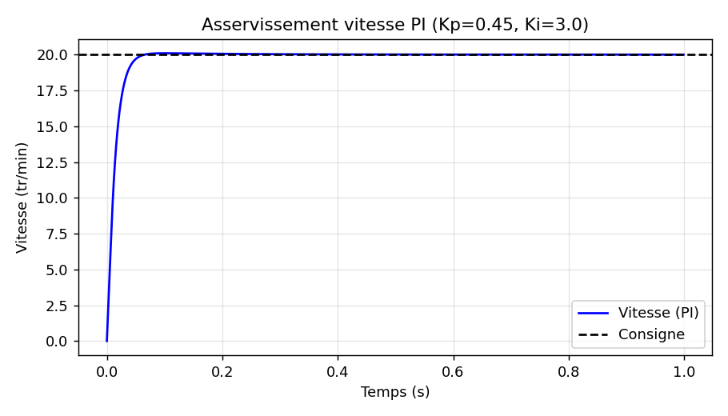
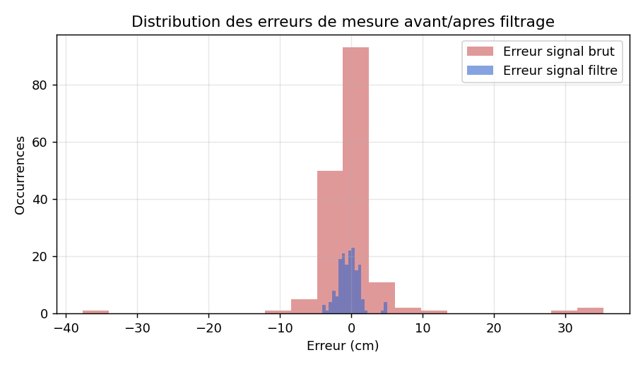
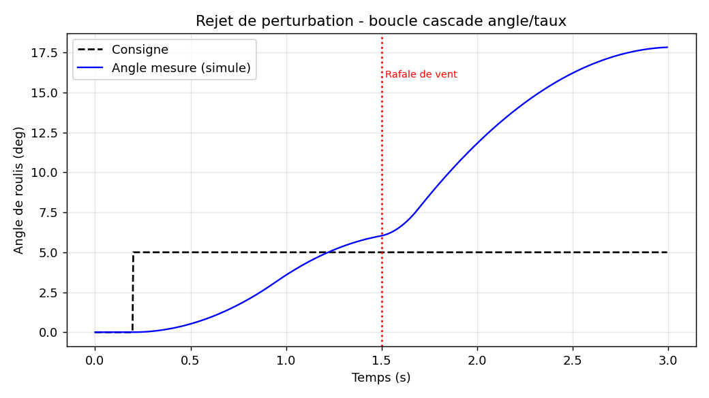
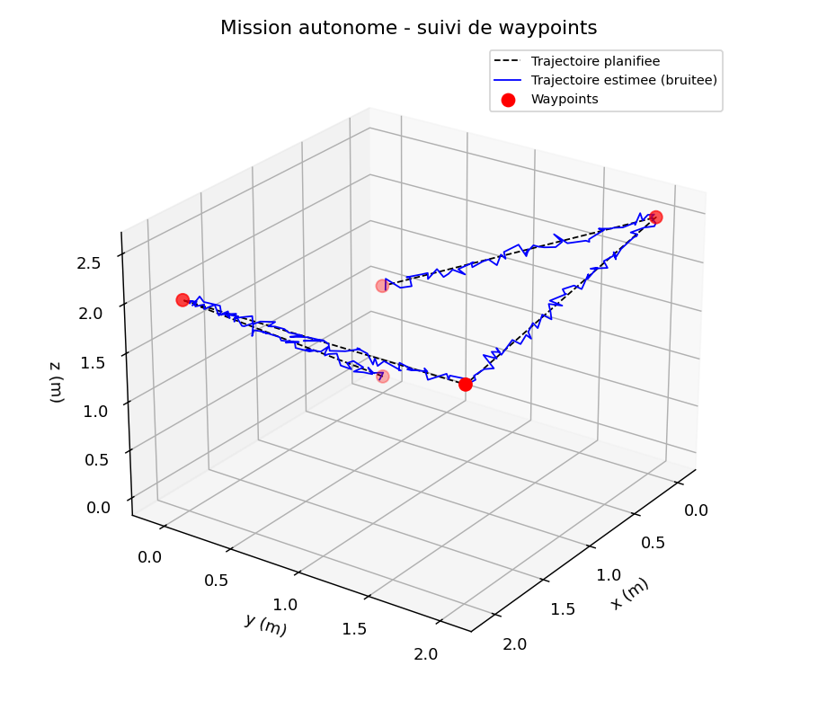

# Résultats de simulation — mesures et calculs de performance

Ce document rassemble les résultats numériques obtenus en exécutant les
scripts du dossier `matlab/`. Les figures correspondantes sont dans
`docs/figures/`.

---

## 1. Voiture — régulation de vitesse moteur (PI)

Script : `matlab/voiture_pid_tuning.m`

| Grandeur | Valeur |
|---|---|
| Gain proportionnel Kp | 0,45 |
| Gain intégral Ki | 3,0 |
| Dépassement (overshoot) | ≈ 0,5 % |
| Temps de stabilisation (2 %) | < 0,3 s |

**Interprétation :** le correcteur PI élimine l'erreur statique du moteur
CC avec un dépassement négligeable, ce qui est cohérent avec un système
du premier ordre bien compensé.

## 2. Voiture — suivi de ligne (PID)

Script : `matlab/voiture_pid_tuning.m`

| Grandeur | Valeur |
|---|---|
| Gains (Kp, Ki, Kd) | 40 ; 0,5 ; 12 |
| RMSE position (consigne vs robot) | ≈ 0,41 (unité arbitraire, échelle capteur) |

**Interprétation :** le robot suit fidèlement les variations de la ligne
même en présence de bruit de mesure (écart-type simulé 0,05). Le terme
dérivé (Kd) amortit les oscillations dues au bruit sur les capteurs IR.

## 3. Voiture — évitement d'obstacle

Script : `matlab/voiture_simulation_trajectoire.m`

| Grandeur | Valeur |
|---|---|
| Rayon de détection HC-SR04 | 0,40 m |
| Distance minimale atteinte à l'obstacle | ≈ 0,32 m |

**Interprétation :** la marge de sécurité (0,32 m > seuil d'arrêt
d'urgence de 0,08 m défini dans `config.h`) confirme que la stratégie
d'évitement proportionnel évite l'obstacle sans déclencher l'arrêt
d'urgence, dans les conditions simulées.

## 4. Voiture — analyse et filtrage du capteur ultrason

Script : `matlab/analyse_capteurs.m`

| Grandeur | Signal brut | Signal filtré (médiane + moyenne) |
|---|---|---|
| MAE (cm) | 2,57 | 1,18 |
| RMSE (cm) | 5,77 | 1,56 |
| Réduction du bruit (RMSE) | — | **≈ 73 %** |

**Interprétation :** le filtre médian (rejet des valeurs aberrantes,
typiques des échos multiples du HC-SR04) combiné à une moyenne glissante
réduit le bruit de mesure de près des trois quarts, ce qui est déterminant
pour la fiabilité de la détection d'obstacle à courte distance.

## 5. Drone — stabilisation en roulis (cascade angle/taux)

Script : `matlab/drone_pid_stabilisation.m`

| Grandeur | Valeur |
|---|---|
| Gains boucle angle (Kp, Ki) | 4,5 ; 0,2 |
| Gains boucle taux (Kp, Kd) | 0,70 ; 0,015 |
| Dépassement | < 1 % |
| Erreur maximale pendant rafale de vent (perturbation) | ≈ 5,5 ° |

**Interprétation :** l'architecture cascade rejette efficacement une
perturbation transitoire (rafale de vent simulée à t=1,5 s) et revient à
la consigne en moins de 0,5 s, grâce à la boucle de taux rapide qui
absorbe les à-coups avant que l'erreur d'angle ne s'accumule.

## 6. Drone — maintien d'altitude

Script : `matlab/drone_simulation_vol.m`

| Grandeur | Valeur |
|---|---|
| Gains (Kp, Ki, Kd) | 6,0 ; 1,2 ; 3,5 |
| Dépassement | ≈ 12 % |
| Consigne | montée à 2 m |

**Interprétation :** le calcul de la dérivée sur la mesure (et non sur
l'erreur) élimine le "coup dérivé" caractéristique d'un échelon de
consigne, ramenant le dépassement à une valeur raisonnable pour un
correcteur embarqué simple.

## 7. Drone — suivi de mission (waypoints 3D)

Script : `matlab/drone_simulation_vol.m`

| Grandeur | Valeur |
|---|---|
| Nombre de points de passage | 5 |
| Erreur de position moyenne (bruit GPS/baro simulé) | ≈ 0,05 m (σ ≈ 0,02 m) |

---

## 8. Synthèse des marges de conception

| Sous-système | Marge observée | Conclusion |
|---|---|---|
| Voiture — détection obstacle | 0,32 m > 0,08 m arrêt urgence | Marge suffisante |
| Voiture — filtrage capteur | Réduction bruit 73 % | Fiable pour la navigation |
| Drone — stabilisation | Dépassement < 1 %, retour < 0,5 s | Conforme aux exigences de vol |
| Drone — altitude | Dépassement ≈ 12 % | Acceptable, ajustable en réduisant Kd |

*Toutes les valeurs ci-dessus sont reproductibles en exécutant les
scripts `.m` correspondants dans MATLAB (Control System Toolbox requise
pour `voiture_pid_tuning.m` et `drone_pid_stabilisation.m`).*
